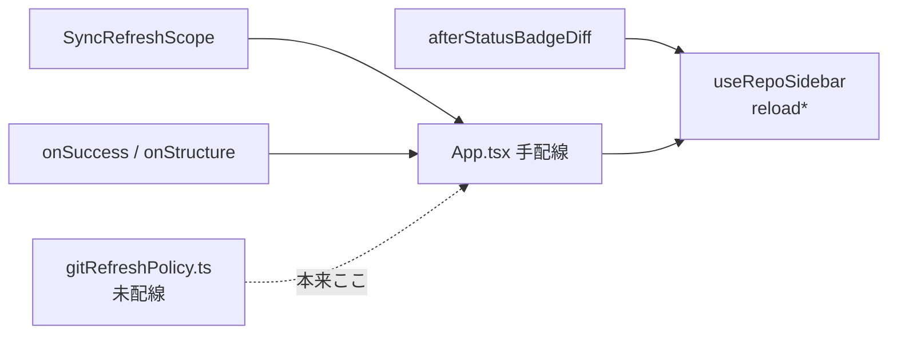

# コード精査: 焦げ・肥大・切り出し候補

調査日: 2026-07-18  
対象: wt-manager（Go `internal/*` + `frontend/src`）

規模感: 本番コードは比較的コンパクト（Go `internal/git` 約 3.8k 行 / 25 ファイル、フロント hooks 中心）。**行数そのものより、責務の集中と「二重の抽象」**が問題。

着手は 1 個ずつ。進行状況は Cursor プラン側を参照。

**進捗:**
1. Refresh ポリシー一本化 — 完了（`useGitRefresh` + `refreshActionsFor` / Toolbar は `GitOp`、`SyncRefreshScope` 削除）
2. `useRepoSidebar` 分割 — 完了（`lib/sidebarLoad.ts` + `useSidebarSelection` / `useSidebarData`、ファサードは `useRepoSidebar`）

---

## 横断まとめ

| 優先 | 対象 | なぜ |
|------|------|------|
| **1** | Refresh ポリシー一本化 | `gitRefreshPolicy` が未配線。Toolbar の `SyncRefreshScope` と手書きコールバックが並存 |
| **2** | `useRepoSidebar` 分割 | ~526 行。load / selection / badge 埋めが同居 |
| **3** | `useGitWorkspaceActions` 分割 | ~507 行 / options ~20。操作カタログ |
| **4** | `GitSyncToolbar` / `RemoteCleanupDialog` | UI + ロジック肥大 |
| **5** | `BranchSidebarDialogs` props | ~46 props の drilling |
| **6** | Go `workspace.go` / `diff.go` / `native_repo.go` | 責務混在・重複ヘルパ |
| **後回し** | `mockApp` / Storybook / Wails 薄いラッパ列 | 意図的 or 本番外 |

意図的に触らない方がよいもの: `native_repo` と CLI の二重実装、diff/hunk パースのコアロジック。

---

## 優先度 High（フロント）

### 1. Refresh ポリシーが定義だけ存在し、実行系と乖離

[`frontend/src/utils/gitRefreshPolicy.ts`](../frontend/src/utils/gitRefreshPolicy.ts) に `RefreshScope`（`status` / `statusAndBadge` / `sidebarFull` 等）と操作別マッピングがあり、テストもある。**しかし hooks / App からは一切 import されていない。**

実際のリフレッシュは別系統が並存:

| 系統 | 場所 | 粒度 |
|------|------|------|
| `SyncRefreshScope` | [`GitSyncToolbar.tsx`](../frontend/src/components/toolbar/GitSyncToolbar.tsx) | `'sidebar' \| 'light' \| 'workspace'` |
| コールバック | [`useBranchActions`](../frontend/src/hooks/useBranchActions.ts) | `onSuccess` / `onStructureChanged` |
| 手書き連鎖 | [`useGitWorkspaceActions`](../frontend/src/hooks/useGitWorkspaceActions.ts) | `afterStatusBadgeDiff` 等 |
| App オーケストレーション | [`App.tsx`](../frontend/src/App.tsx) | `handleLightRefresh` / `handleSyncComplete` / revision bump |



**切り出し方針:** `gitRefreshPolicy` を単一の実行入口（例: `useGitRefresh` / `applyRefreshScope`）にし、Toolbar / Branch / Workspace の事後処理をそこに寄せる。`SyncRefreshScope` は廃止 or ポリシーへマップ。

---

### 2. `useRepoSidebar`（約 526 行）— God hook — **完了**

[`frontend/src/hooks/useRepoSidebar.ts`](../frontend/src/hooks/useRepoSidebar.ts) は薄いファサード。実装は:

- 純関数 → [`lib/sidebarLoad.ts`](../frontend/src/lib/sidebarLoad.ts)（equal / merge* / fill*）+ [`resolveSidebarLoadSelection`](../frontend/src/lib/sidebarSelection.ts)
- hook → [`useSidebarSelection`](../frontend/src/hooks/useSidebarSelection.ts) + [`useSidebarData`](../frontend/src/hooks/useSidebarData.ts)

旧メモ（混在していた責務）:

- キャッシュ読取・スナップショット比較（`sidebarSnapshotEqual`）
- 選択決定（早期 WT 選択含む）
- `loadSidebar` 本体（約 240 行の巨大コールバック）
- 裏埋め: `fillBranchTracks` / `fillWorktreeBadges`
- 部分更新: `reloadBranches` / `reloadWorktreesMeta` / `refreshWorktreeBadge*`

~~**切り出し候補:**~~

- ~~純関数 → `lib/sidebarLoad.ts`（equal / mergeTracks / fill*）~~
- ~~hook 分割 → `useSidebarSelection` + `useSidebarData`（load/reload）+ progressive enrich は data 側に残す~~

---

### 3. `useGitWorkspaceActions`（約 507 行 / オプション約 20 個）— God hook

[`frontend/src/hooks/useGitWorkspaceActions.ts`](../frontend/src/hooks/useGitWorkspaceActions.ts)

1 フックに stage/unstage、commit/amend/rebase、hunk/line、外部ツール、コンテキストメニューが同居。戻り値も 20 超。hunk/line 6 系がほぼ同一テンプレ。

**切り出し候補:**

- `useFileContextMenu`（`handleFileContextMenu` 〜70 行）
- `useHunkLineActions`（Stage/Unstage/Discard × hunk/lines）
- `useCommitRebaseActions`（commit / continueRebase / amendInfo / repoOperation）
- 親は薄いファサードに

---

### 4. `App.tsx`（約 407 行）— 配線ハブの肥大

[`frontend/src/App.tsx`](../frontend/src/App.tsx)

- Busy ハンドラが 3 系統ほぼ同型（workspace / toolbar / sidebar）
- Refresh ハンドラ群（badge / light / sync / manual / window activate）がここ集中
- JSX への props 渡しが密（約 70 箇所）

**切り出し候補:** `useOverlayBusy`（3 チャネル統合）、`useWorkspaceRefresh`（上記ポリシー実行体）

---

### 5. `BranchSidebarDialogs`（約 299 行 / ~46 props）— prop drilling 最悪

[`BranchSidebarDialogs.tsx`](../frontend/src/components/sidebar/BranchSidebarDialogs.tsx)

ダイアログ列挙自体は妥当な抽出だが、フラット props 地獄。`BranchSidebar` がダイアログ状態を持ち、ほぼ全部を素通し。

**切り出し候補:**

- グループ化 props（`errors`, `branchDialogs`, `worktreeDialogs`, `stashDialogs`）
- または各フックが自前でダイアログを返す（composition）

---

## 優先度 Medium（フロント UI）

| ファイル | 行数 | 問題 | 切り出し |
|----------|------|------|----------|
| [`RemoteCleanupDialog.tsx`](../frontend/src/components/toolbar/RemoteCleanupDialog.tsx) | ~587 | 取得・フィルタ・削除・除外リスト・ネスト Dialog が同居 | `ExcludedListDialog` 分離、`useRemoteCleanup` へロジック移動 |
| [`GitSyncToolbar.tsx`](../frontend/src/components/toolbar/GitSyncToolbar.tsx) | ~564 | インライン Icon 多数 + sync 実行 + RemoteCleanup ホスト。`useBusy` と非対称な自前 acting | Icon → [`GitSyncIcons.tsx`](../frontend/src/components/toolbar/GitSyncIcons.tsx)、`useGitSyncActions`、dialogs 分離 |
| [`HistoryView.tsx`](../frontend/src/components/git/HistoryView.tsx) | ~416 | `HistoryScopeBar` が同ファイル | ScopeBar コンポーネント分離 |
| [`BranchSidebar.tsx`](../frontend/src/components/sidebar/BranchSidebar.tsx) | ~375 | 多数 hook のオーケストレーション | filter / compare 配線の整理 |
| [`DiffView.tsx`](../frontend/src/components/git/DiffView.tsx) | ~324 | hunk アクション JSX の重複 | `DiffHunk` / `DiffHunkActions` / `DiffLine` |
| [`GitWorkspace.tsx`](../frontend/src/components/git/GitWorkspace.tsx) | ~368 | フック合成は健全。`ChangesPanel` へ ~20 コールバック | actions オブジェクト化候補 |

### その他フロントの重複

- `CloseIcon` が Settings / RemoteCleanup / GitDebug / RepoTabBar 等にコピペ
- `CommitDetailPane` ↔ `CompareDetailPane` の split/prefetch ほぼコピー
- Busy パターン非対称（Workspace=`useBusy`、Toolbar=自前、Sidebar=集約）

### Wails API 面の 4 重ミラー

| 層 | 規模 |
|----|------|
| Go `App` メソッド | `git_api.go` だけで 66、全体 ~86 |
| [`wails/types.ts`](../frontend/src/lib/wails/types.ts) | ~82 |
| [`wails.ts`](../frontend/src/lib/wails.ts) wrappers | ~82 |
| [`mockApp.ts`](../frontend/src/lib/wails/mockApp.ts) | **~1090 行** |

薄いラッパは Wails の宿命。mock がドメイン未分割で最大ファイル。API 追加のたびに 4 箇所更新。

---

## 優先度 Low（意図的 or 本番外）

| 対象 | コメント |
|------|----------|
| [`BranchIcons.stories.tsx`](../frontend/src/components/sidebar/BranchIcons.stories.tsx) ~1015 | アイコン探索用。本番影響は薄いが `tsc -b` コスト |
| [`mockApp.ts`](../frontend/src/lib/wails/mockApp.ts) | 意図的フルモック。必要なら domain 分割 |
| [`wails.ts`](../frontend/src/lib/wails.ts) | 薄い `callApp` ラッパ列挙は許容 |
| [`GitGraph.tsx`](../frontend/src/components/git/graph/GitGraph.tsx) | グラフ計算の凝集。分割は曲線/レイアウト程度 |
| Stories 全般 | デモ用途。リファクタ優先度は低い |
| [`SettingsDialog`](../frontend/src/components/settings/SettingsDialog.tsx) | ToolFields 抽出済で妥当規模 |

### フロントで健全な点

- `GitWorkspace` は既に hooks + `GitWorkspaceDialogs` に分割
- History 側に `useHistoryFileContextMenu` / `useShowFileInExplorer` がある
- `RepoSidebarContent` は表示寄りで比較的薄い
- `wails.ts` の lazy mock import は本番バンドル配慮として妥当
- `gitRefreshPolicy.ts` は方向性として正しい（未配線が課題）

---

## Go バックエンド

### 全体構造

```
main.go                    # Wails 起動のみ（~50行）
internal/
  app/   (~942 LOC, 10 files)  # Wails Bind ファサード
  config/(~281 LOC, 1 file)    # config.json 永続化
  git/   (~3756 LOC, 25 files) # Git 操作のほぼ全部
```

依存: `main` → `app` → (`config` + `git`)  
例外: **`git` → `config`**（`logging.go` が `config.LogsDir()`）— ドメインが設定層に依存するレイヤリング臭い。

### App — God object か？

**メソッド数では yes、状態・ロジックでは no（薄いファサード）。**

| 指標 | 値 |
|------|-----|
| エクスポート済み `App` メソッド | **84** |
| うち `git_api.go` | 66 |
| うち `settings.go` | 12 |
| `App` 構造体のフィールド | `ctx` + progress debounce のみ |

改善: Bind は `*App` のまま、`git_api.go` をドメイン別ファイルへ分割。

### 肥大化トップファイル

| ファイル | 行数 | 優先度 | なぜ懸念か |
|----------|------|--------|------------|
| `internal/git/diff.go` | ~394 | **High** | 取得 API + unified パース + hunk 編集が同居。Get*Diff がほぼ同型 |
| `internal/git/native_repo.go` | ~391 | **High** | go-git ヘルパ寄せ集め。open 毎回、upstream 解決の重複 |
| `internal/app/git_api.go` | ~373 | **Medium** | メソッド 66 の機械的ラッパ |
| `internal/git/remote_cleanup.go` | ~304 | **Medium** | マージ判定 + 並列ワーカー + 削除。`contentMergedRemotes` ~77 行 |
| `internal/git/workspace.go` | ~301 | **High** | **最も混在が強い**: stage、hunk/line patch、discard、commit/amend |
| `internal/config/config.go` | ~281 | **Low–Medium** | 境界は明確だが単一ファイルに集約 |
| `internal/git/commits.go` | ~256 | **Low–Medium** | 長いが責務は一貫 |
| `internal/git/sync.go` | ~189 | **Medium** | Fetch/Pull/Push の WithProgress 二重 API |

### Go 結合・アーキテクチャ臭い

**High**

1. `internal/git` メガパッケージ（25 ファイル / ~3.8k LOC）
2. CLI git と go-git の二系統（意図は明確だが意味論二重実装）
3. `git` → `config` 依存

**Medium**

4. `filepath.Abs` が 40+ 箇所に散在（二重正規化）
5. グローバル可変状態（`defaultRunner`、read caches 等）
6. `parseUpstreamRef` / `splitRemoteRef` ほぼ同型
7. first-parent 処理が `commit_files.go` と `diff.go` で重複
8. progress 二重 API（App は常に WithProgress）

### Go 抽出候補

**High**

| 候補 | 内容 |
|------|------|
| `workspace.go` 分割 | `index.go`（stage/discard）、`patch_apply.go`、`commit.go`、merge 状態は `rebase.go` 近傍へ |
| `diff.go` → `diff_parse.go` + `diff_hunk.go` | 取得 API とパース/編集を分離。Get*Diff 共通化 |
| `native_repo.go` 整理 | open / branch / upstream ヘルパ集約。可能なら repo ハンドル再利用 |
| Abs ヘルパ | Abs+Clean を 1 関数に |

**Medium**

| 候補 | 内容 |
|------|------|
| `git_api.go` ドメイン分割 | status/diff、branches、sync、history、stash |
| `remote_cleanup.go` | 判定と削除を分離 |
| progress API 簡略化 | 公開は WithProgress のみ or `runNetwork` 1 本 |
| `splitRemoteRef` 統合 | sync / remote_cleanup で共有 |
| `git`→`config` 切断 | LogsDir を注入 or `internal/paths` |

**Low:** `config.go` 分割、commits 型分離、tool 系の `config.Load` ヘルパ

### Go で健全な点

- `main.go` は薄い。`internal/app` に正しく寄せている
- `gitRunner` 抽象 + fake runner でテスト可能
- App 層の `withWorktree` / `mutateWorktree` / read cache は意図が明確
- ファイル名による領域分割（stash/rebase/sync/worktrees）は既にある

---

## 推奨着手順

1. **`gitRefreshPolicy` を実行系に配線** — 挙動バグ温床を減らし、App / hooks のコールバック網を薄くできる
2. **`useRepoSidebar` の純関数切り出し** — リスク低・テストしやすい
3. **`useGitWorkspaceActions` 分割**
4. **`BranchSidebarDialogs` props グループ化**
5. **RemoteCleanup / GitSyncToolbar の UI・ロジック分離**
6. **Go `workspace.go` / `diff.go` 責務分割**
7. **mockApp / git_api のドメイン分割**
8. **Abs / progress / remote-ref 共通化**（低リスク・高 ROI）

フロント短期の別案（リスク更に低め）: hunk/line factory と toolbar sync actions から切る、という順も可。
