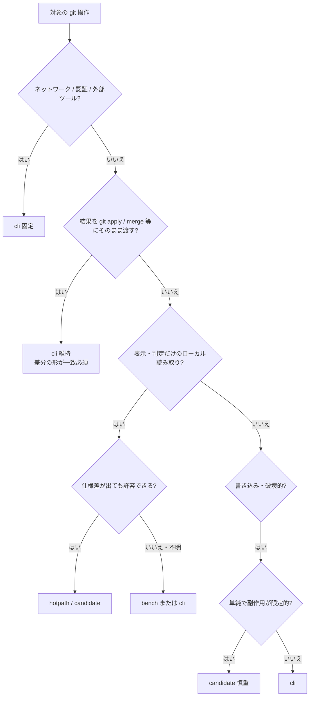

# go-git 移行の判定条件

最終更新: 2026-07-18

操作一覧・現状の分類は [`git-backend.md`](./git-backend.md) を正とする。  
この文書は「**この操作を Go（go-git / 純 Go）に置き換えてよいか**」を決めるときの判定資料。

---

## 前提（初心者向け）

| 用語 | 意味 |
|------|------|
| CLI / `git.exe` | OS 上の本物の Git をプロセス起動する現行方式。Windows では起動コストが大きい |
| go-git | Go から `.git` を直接読むライブラリ。プロセス起動は不要 |
| ホットパス | 画面を開いたときなど、頻繁に走る読み取り |
| Git Debug 窓 | CLI spawn だけ見える。go-git にするとログから消える |

go-git は Git の完全互換実装ではない。  
「結果がだいたい同じ」でも、**次の本物 git 操作にその結果を渡す**と壊れることがある。

---

## 判定フロー（上から）



1. **ネットワーク・認証・外部 GUI ツール** → 即 `cli`
2. **出力を後段の本物 git に食わせる** → 原則 `cli`
3. **ローカルの状態読み・表示のみ** → go 化候補
4. **書き込み** → 原則慎重。単純でも回帰テスト必須

---

## 必須条件（すべて満たすこと）

Go 化する操作は、次をすべて満たすこと。

| # | 条件 | 説明 |
|---|------|------|
| 1 | ローカルのみ | リモート通信・GCM・SSH エージェント不要 |
| 2 | 出力を CLI に再投入しない | 例: go 製 unified diff を `git apply` に渡さない |
| 3 | 仕様差が許容できるか明示済み | 「完全一致必須」なら Go 化しない |
| 4 | API 表面を変えない | Wails / FE のシグネチャは維持 |
| 5 | 二重フォールバックしない | 失敗時に同じ意味の CLI へ落とす二重実装は避ける（[`git-backend.md`](./git-backend.md) の方針） |
| 6 | テストがある | 実リポ or fake で期待挙動を固定する |

1 つでも欠けるなら、当面 `cli`（または `bench`）。

---

## 禁止・長期 CLI（満たしたら Go 化しない）

次のいずれかに当てはまる操作は **置き換えない**。

| パターン | 例 | 理由 |
|----------|-----|------|
| ネットワーク同期 | `fetch` / `pull` / `push` | Windows GCM 認証。CLI 固定 |
| 外部ツール待ち | `mergetool` / `difftool` | ユーザー環境の GUI |
| FSMonitor / daemon | `config core.fsmonitor` / `fsmonitor--daemon` | Git 本体の設定・デーモン操作 |
| apply 互換の差分生成 | 追跡ファイルの `diff` / `--cached` | hunk 境界が go-git とズレると stage/discard が壊れる |
| 破壊的で複雑な書き込み | `reset --hard` + `clean`、rebase 本体 | 失敗時のリカバリと CLI 挙動一致が重要 |
| 要ベンチの status 系 | `status --porcelain`、WT バッジ集計 | 大型 ignore で go-git が遅くなる場合あり。FSMonitor 恩恵も消える |

### 「完全一致が必須」のサイン

次に当てはまる出力は、Go 化を強く避ける。

- そのテキスト／バイナリを **`git apply` / `git commit` / `git merge` 等の stdin・引数に渡す**
- ユーザーが「git と同じ hunk」を前提に操作する（行選択 stage など）
- 終了コードの意味が操作の一部（例: `diff` の exit 1 = 差分あり）で、後段がそれに依存

逆に、次だけなら差を許容しやすい。

- UI に出すだけ（ahead 数、ブランチ名、マージ中かどうか）
- 内部の bool / int / 文字列で、後段が再パースして git に渡さない
- 構造が単純（未追跡ファイル＝全文追加、など）

---

## Go 化してよい（候補の型）

| 型 | 例 | 目安 |
|----|-----|------|
| ref / HEAD の有無 | `MERGE_HEAD` / `REBASE_HEAD` / `HEAD` | ファイル・ref の存在確認。Debug の「失敗」も減る |
| ブランチ・upstream 解決 | `@{upstream}`、branch 一覧メタ | config + refs。既存 hotpath と同系統 |
| 到達可能性カウント | `rev-list --count A..B`、ahead/behind | 既に `countExclusiveCommits` あり |
| 単純な内容合成 | 未追跡の「全部追加」diff | ディスク読取のみ。apply に渡す場合は `HunkToPatch` 経由で形を固定 |
| ラベル用 ref 列挙 | heads / remotes / tags | 表示用 |

分類ラベルは [`git-backend.md`](./git-backend.md) の凡例に合わせる。

- 実装して通したら → `hotpath`
- まだだが条件を満たす → `candidate`
- 条件は満たすが速度が怪しい → `bench`

---

## チェックリスト（PR / 実装前）

コピーして使う。

```text
[ ] ネットワーク・GCM・外部ツールを使わない
[ ] 出力を git apply / merge / commit 等に直接渡さない（または渡す形を自前で固定しテスト済み）
[ ] 「git とバイト一致必須」ではないことを確認した
[ ] Wails / FE API を変えない
[ ] CLI フォールバック二重実装にしない
[ ] 実リポまたは同等のテストを追加した
[ ] docs/git-backend.md の分類を更新した
[ ] Git Debug 窓から当該 CLI が消えることを確認した（期待どおり）
```

---

## よくある誤解

| 誤解 | 実際 |
|------|------|
| Debug に出る＝バグ | CLI を呼んでいるだけ。`MERGE_HEAD` 不在の exit 1 は「マージしてない」で正常 |
| go-git 化＝全部速くなる | status などでは遅くなることもある（`bench`） |
| 未追跡 diff を Go 化したから追跡 diff も同じ | 追跡 diff は apply 互換が要るので別物 |
| candidate ならすぐやる | 条件を満たす「候補」。優先度とテストコストは別判断 |

---

## 関連

- 操作一覧・現状分類: [`git-backend.md`](./git-backend.md)
- CLI 計装: [`internal/git/inflight.go`](../internal/git/inflight.go)
- go-git 実装: [`internal/git/native_repo.go`](../internal/git/native_repo.go)
