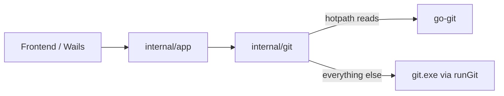

# Git バックエンド（CLI / go-git）

最終更新: 2026-07-18

## 方針

wt-manager の Git 操作はもともとすべて PATH 上の `git`（Windows では `git.exe`）を `os/exec` で起動している（[`internal/git/git.go`](../internal/git/git.go)）。

`CreateProcess` のオーバーヘッドを減らすため、**ホットパスのローカル読み取り**だけ [go-git](https://github.com/go-git/go-git) に切り替える。

認識の整理:

- 「データフェッチ以外が全部 go-git」ではない
- ネットワーク（`fetch` / `pull` / `push`）は Windows GCM 認証のため **CLI 固定**
- `status` は go-git の方が大型 ignore で遅くなることがあり、FSMonitor の恩恵も消えるため **当面 CLI**

置き換え可否の判定条件は [`git-backend-migration-criteria.md`](./git-backend-migration-criteria.md)。

## 分類凡例

| 分類 | 意味 |
|------|------|
| `hotpath` | 今回 go-git 化済み（または移行対象） |
| `candidate` | 将来 go-git 候補（ローカル・単純） |
| `cli` | 当面〜長期 CLI 維持 |
| `bench` | 要ベンチ。現状は CLI（go-git 化しない） |

## デバッグ窓

設定の Git Debug（[`inflight.go`](../internal/git/inflight.go)）は **CLI spawn のみ**可視化する。go-git 呼び出しは出ない。

---

## 操作一覧

### 実行基盤 — `git.go`

| 操作 | コマンド | 分類 | 備考 |
|------|----------|------|------|
| ResolveRepo | `rev-parse --show-toplevel` | `hotpath` | go-git `PlainOpen` + worktree root |

### ブランチ — `branches.go`

| 操作 | コマンド | 分類 | 備考 |
|------|----------|------|------|
| listBranchesMeta | `for-each-ref` heads/remotes | `hotpath` | refs + config upstream |
| countAheadBehind | `rev-list --left-right --count A...B` | `hotpath` | commit 到達可能性 |
| SwitchBranch | `switch` | `cli` | |
| CheckoutRemoteBranch | `rev-parse` + `switch -c --track` | `cli` | |
| CreateBranch | `switch -c` | `cli` | |
| DeleteBranch | `branch -d/-D` | `cli` | 現行判定は `CurrentBranch`（hotpath） |
| RenameBranch | `branch -m` | `cli` | |
| MergeBranch | `merge --no-edit` | `cli` | |
| SquashMergeBranch | `merge --squash` | `cli` | |
| ResetToCommit | `reset --soft/--mixed/--hard` | `cli` | |

### 同期 — `sync.go`

| 操作 | コマンド | 分類 | 備考 |
|------|----------|------|------|
| GetUpstream / currentUpstream | （なし）config + HEAD | `hotpath` | 旧 `rev-parse @{upstream}` |
| Fetch | `fetch --progress` / `--prune` | `cli` | ネットワーク + GCM |
| FetchCurrentUpstream | `fetch <remote> <branch>` | `cli` | remote/branch 解決は hotpath |
| Pull | `pull --progress` | `cli` | |
| Push | `push --progress` | `cli` | |
| PushSetUpstream | `push -u <remote> HEAD` | `cli` | |

### status — `status.go`

| 操作 | コマンド | 分類 | 備考 |
|------|----------|------|------|
| GetStatus / countChangedFiles | `status --porcelain=v1 -u` | `bench` | WT バッジ含む。CLI 維持 |
| enrichStatusEntries | `ls-files -s` | `cli` | status 付随 |

### workspace — `workspace.go`

| 操作 | コマンド | 分類 | 備考 |
|------|----------|------|------|
| Stage / Unstage / Discard | `add` / `restore` / `clean` | `candidate` | |
| DiscardAll | `reset --hard` + `clean -fd` | `cli` | 破壊的 |
| AbortMerge | `merge --abort` / `reset --merge` | `cli` | 判定は hotpath |
| IsMergeInProgress / IsSquashPending | （なし）`.git/MERGE_HEAD` / `SQUASH_MSG` | `hotpath` | 旧 `rev-parse` |
| ApplyPatch | `apply` (+ `--cached` / `--reverse`) | `cli` | |
| Commit / Amend | `commit` / `commit --amend` | `candidate` | |
| amend ガード | （なし）HEAD / merge / rebase / ahead | `hotpath` | 旧 `log` + `rev-list` |

### worktree — `worktrees.go`

| 操作 | コマンド | 分類 | 備考 |
|------|----------|------|------|
| ListWorktrees | `worktree list --porcelain` | `candidate` | go-git は partial |
| AddWorktree | `worktree add` / `-b` | `cli` | |
| RemoveWorktree | `worktree remove` | `cli` | |

### 履歴 — `commits.go` / `commit_files.go`

| 操作 | コマンド | 分類 | 備考 |
|------|----------|------|------|
| ListCommits | `log --topo-order` | `candidate` | |
| listCommitsBySHA | `rev-parse ^{commit}` + `log -1` | `candidate` | |
| ListBranchHeads | `for-each-ref` heads/remotes/tags | `hotpath` | ラベル用 |
| CurrentBranch | `rev-parse --abbrev-ref HEAD` | `hotpath` | |
| ListCommitFiles | `diff --name-status` / `diff-tree` / `show` | `candidate` | |
| parent count | `rev-list --parents` | `candidate` | |

### diff — `diff.go`

| 操作 | コマンド | 分類 | 備考 |
|------|----------|------|------|
| GetFileDiff（未追跡） | （なし）index 判定 + ファイル読取 | `hotpath` | 旧 `diff`→`ls-files`→`diff --no-index` の 3 spawn を廃止 |
| 各種 diff（追跡 / commit / range） | `diff` / `--cached` / `show` | `cli` | exit 1 = 差分あり。apply 互換のため当面 CLI |

### rebase — `rebase.go`

| 操作 | コマンド | 分類 | 備考 |
|------|----------|------|------|
| IsRebaseInProgress | （なし）`.git/REBASE_HEAD` | `hotpath` | |
| detached 判定 | （なし）HEAD is branch? | `hotpath` | 旧 `symbolic-ref` |
| Rebase / continue / abort | `rebase` | `cli` | |
| PullRebase | `pull --rebase --progress` | `cli` | |

### stash — `stash.go`

| 操作 | コマンド | 分類 | 備考 |
|------|----------|------|------|
| list / push / apply / pop / drop | `stash *` | `cli` | |

### remote cleanup — `remote_cleanup.go`

| 操作 | コマンド | 分類 | 備考 |
|------|----------|------|------|
| origin/HEAD | `rev-parse refs/remotes/origin/HEAD` | `candidate` | |
| list remotes | `for-each-ref refs/remotes/` | `candidate` | |
| merged 判定 | `for-each-ref --merged` / `merge-tree` | `cli` | |
| delete remote branches | `push --delete` | `cli` | |

### tools / fsmonitor — `tools.go` / `fsmonitor.go`

| 操作 | コマンド | 分類 | 備考 |
|------|----------|------|------|
| mergetool / difftool | `mergetool` / `difftool` | `cli` | 外部プロセス待ち |
| unmerged 判定 | `ls-files -u` | `candidate` | |
| FSMonitor config / daemon | `config` / `fsmonitor--daemon` | `cli` | |

---

## 今回の受け入れ条件

- 本ドキュメントに全操作が分類付きで載っている
- ホットパス（上表の `hotpath`）が go-git 経由
- API 表面（Wails / FE）は変更なし
- 品質ゲート: `go test -short ./internal/...` / `go build ./...` / frontend `tsc -b` + `pnpm test`

## 意図的にやらないこと（今回）

- `status` / WT バッジの go-git 化
- fetch/pull/push、merge/rebase、worktree add/remove、stash、commit/stage、**追跡ファイルの diff apply 互換パス**
- 一括 API（`ListWorktreeChangedCounts` 等）
- Git Debug への go-git 計装
- ホットパス失敗時の CLI フォールバック（二重実装を避ける）
